# Despliegue en producción de un Modelo TF2 de clasificación de imágenes.

## Introducción

El Objetivo de este Post es presentar una solución al despliegue en producción de modelos de deep learning desarrollados en Tensorflow2.


 En este caso vamos a utilizar un modelo de clasificación entre dos categorias de animales de compañia: ```Perros``` vs ```Gatos```.  
 El jupyter-notebook utilizado para entrenar dicho modelo se en cuentra en la siguiente ruta: ``concept\PipelineClasificationImages.ipynb``

Puede encontralo también preparado para ejecutarse en google colab a partir del siguiente [enlace](
https://colab.research.google.com/github/jaisenbe58r/ProductionTF2serving/blob/main/PipelineClasificationImages.ipynb):

<div align="center">
  <table class="tfo-notebook-buttons" align="left">
    <td>
      <a target="_blank" href="https://colab.research.google.com/github/jaisenbe58r/iAApi-QAS-BERT/blob/main/SQUAD_es_GPU.ipynb">Run in Google Colab</a>
    </td>
    <td>
      <a target="_blank" href="https://github.com/jaisenbe58r/ProductionTF2serving/blob/main/PipelineClasificationImages.ipynb">View source on GitHub</a>
    </td>
  </table>
</div>
...

**Referencias:**

- [Mirko J. Rodríguez - Udemy - Deep Learning aplicado: Despliegue de modelos TensorFlow 2.0](https://www.udemy.com/course/deep-learning-despliegue-tensorflow-mirko-rodriguez/)
- [Keras.io: Transfer learning & fine-tuning](https://keras.io/guides/transfer_learning/)
- [Keras.io - Image classification from scratch](https://keras.io/examples/vision/image_classification_from_scratch/#run-inference-on-new-data)
- [Kaggle Cats and Dogs Dataset](https://www.microsoft.com/en-us/download/details.aspx?id=54765)
- [keras.io - EfficientNet B0 to B7](https://keras.io/api/applications/efficientnet/)

**Autor**:
- [Jaime Sendra Berenguer](https://www.jaimesendraberenguer.com/)

<div align="center">
  <table class="tfo-notebook-buttons" align="left">
    <td>
      <a target="_blank" href="https://www.linkedin.com/in/jaisenbe/">Linkedin</a>
    </td>
    <td>
      <a target="_blank" href="https://github.com/jaisenbe58r">GitHub</a>
    </td>
    <td>
      <a target="_blank" href="https://medium.com/@jaimesendraberenguer">Medium Blog</a>
    </td>
    <td>
      <a target="_blank" href="https://www.kaggle.com/jaisenbe58r">Kaggle</a>
    </td>
  </table>
</div>


## Definición de la Arquitectura


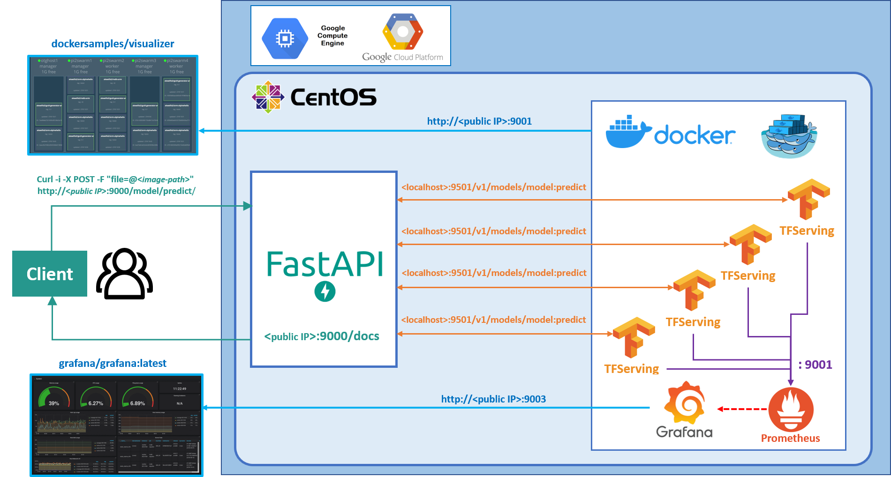

Se ha optado por una arquitectura basada en microservicios a partir de un clúster de docker swarm. Dicho clúster esta desplegado sobre un servidor CentOS 7 en una maquina virtual del Compute Engine de Google cloud, donde también estará desplegada la API de FastAPI encargada de gestionar todas las peticiones HTTP recibidas de los clientes. Esta API será el punto de acceso a la aplicación desde el exterior, a partir de la cual se podrá enviar una imagen a procesar y posteriormente recibir las prediccionas tras el proceso de inferencia realizado en los microservicios de TensorflowServing.

Estos microservicios de TensorflowServing se encargan de hacer inferencia de la imagen recibida sobre el modelo contenido en ellos que previamente hemos generado a partir del proceso de despliegue.

También se ha añadido el microservicio ```visualizer``` que nos permitirá monitorizar los microservicios en ejecución dentro del clúster:


A su vez, se integran también los microservicios de grafana y prometheus, encargados de administrar y generar dashboards dinámicos para mostrar las métricas configuradas del clúster.


Con ello, estaremos desplegando en producción una solución de deep learning basada en microservicios de alta disponibilidad, capaz de hacer frente a un considerable volumen de peticiones HTTP de diferentes clientes. También se dota a esta arquitectura de una alta capacidad de escalamiento, puesto que el clúster de docker swarm nos permite hacer réplicas de cada microservicio en particular.


## Crear servidor de despliegue

En primer lugar, se va a crear el servidor de despliegue en producción que vams a utiloizar en este proyecto. Para ello necesitamos crear una cuenta en Google Cloud Plataform, donde nos dan la posibilidad de crearnos una cuenta gratuita de 90 días con 300 USD en crédito para poder utilizar servicios como Compute Engine, Cloud Storage y BigQuery.

Para acceder visite el siguiente enlace: https://console.cloud.google.com/


Una vez registrados, nos debe aparecer la página principal con el Dashboard general de la aplicación:

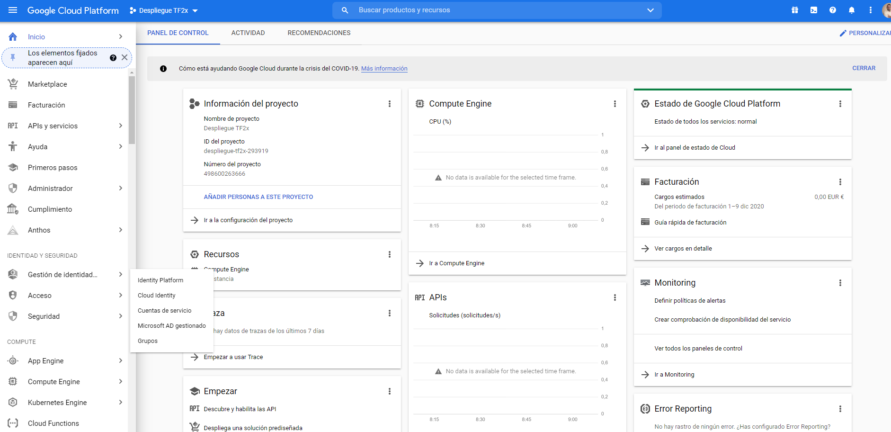

Seguidamente rocedemos a crear un nuevo proyecto de trabajo, pulsamos sobre el desplegable de proyectos, ```Despliegue TF2x``` en mi caso, y nos aparece la siguiente ventana emergente:

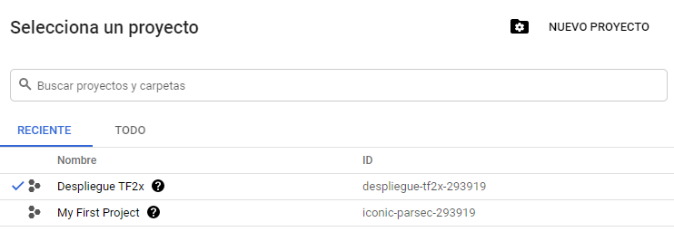

Pinchamos sobre ```NUEVO PROYECTO``` y nos aparece la ventana creación de un nuevo proyecto. Aquí asignamos el nombre que queramos para nuestro proyecto, en mi caso ```Despliegue TF2x```:

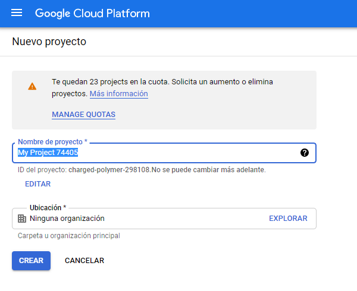

A continuación, vamos a crear la maquina virtual para el despliegue. En este caso vamos a utilizar una máquina con el so de Centos7. Para poder crear y configurar dicha máquina, primero hacemos una búsqueda ```Centos```y seleccionamos la ```CentOS 7```que vamos a dar de alta:

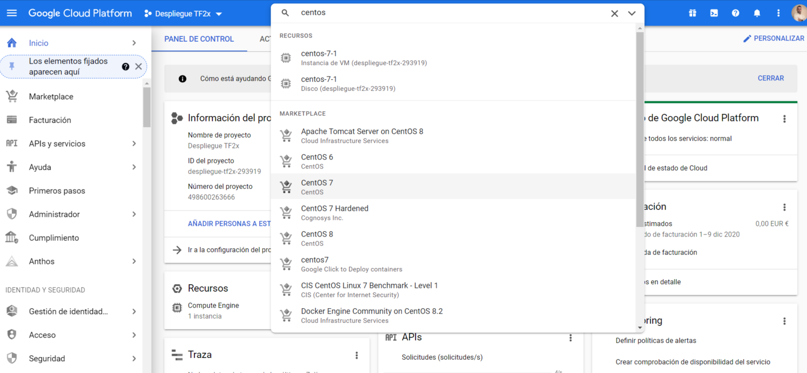

Una vez seleccionada nos aparece la siguiente ventana donde debemos iniciar la maquina pulsando sobre el botón ```iniciar```:

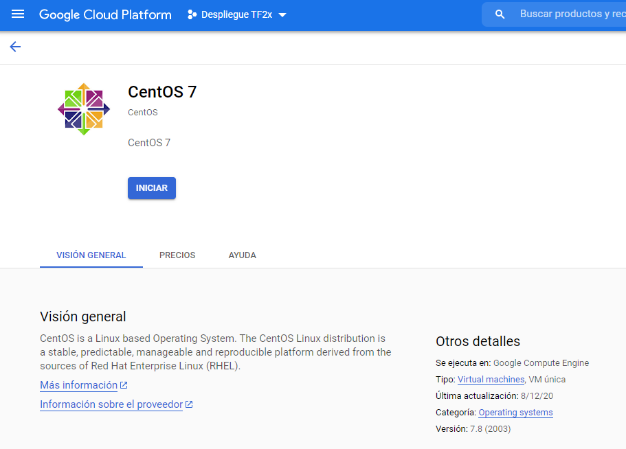

Una vez dentro, procedemos a configurar la máquina. en nuestro caso vamos a configurar el Tipo de máquina y su cortafuegos para permitir peticiones HTTP:

**Tipo de máquina**: e2-standard-4 (4 vCPU, 16 GB de memoria)

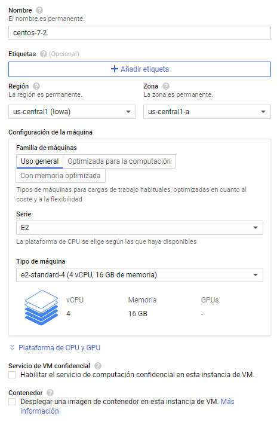

**Cortafuegos**: Permitir el tráfico HTTP.

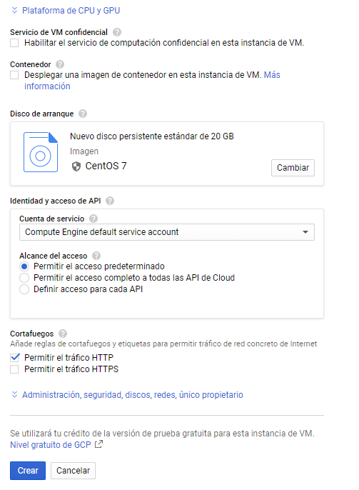

Una vez configurada nos aparecera la siguiente ventana con nuestra máquina:

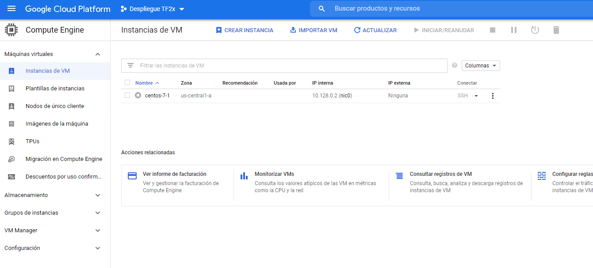

Como podeis observar también nos indica la IP externa de la máquina. Para acceder la la consola necesitaremos pulsar en el botón de ```PLAY``` y en el desplegable de ```SSH`` seleccionar la opción de abrir en una nueva pestaña del navegador:

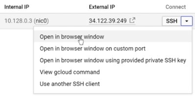

Con ello, ya tenemos acceso a la consola de nuestro servidor, pero antes de seguir nos haria falta configurar las reglas del cortafuegos para permitir el acceso a través de los puertos de cada servicio.

La forma de acceder a esta configuración es pulsando en el desplegable de ```SSH``` en la opción de ```ver detalles de red```:

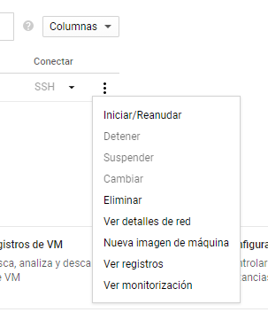

Una vez dentro, pinchamos sobre ```default-allow-http```:

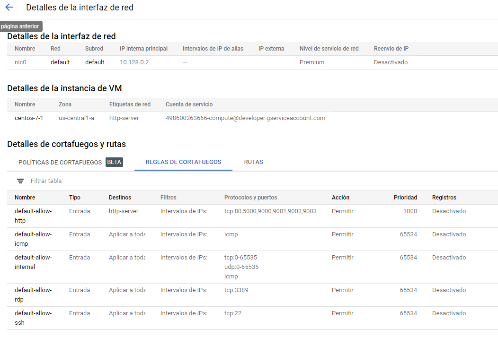

Seguidamente damos click a la opción de ```EDITAR```:

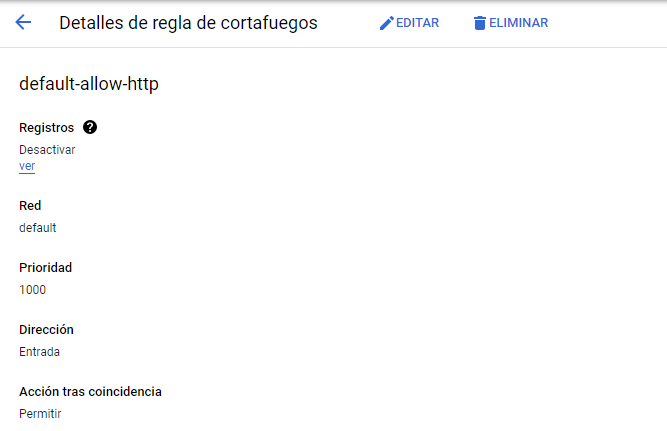

Una vez dentro damos de alta todos los puertos utilizados en los servicios del proyecto:

- **9000**: API del servidor.
- **9001**: Visualizador de microservicios.
- **9002**: Prometheus.
- **9003**: Grafana.

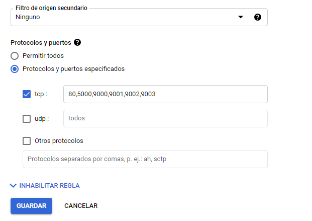


Con todos estos pasos ya tendriamos acceso a la maquina virtual del servidor y podriamos proceder a configurar el entorno de trabajo y a dar de alta los servicios de nuestro proyecto.


## Configuración del entorno de trabajo

Una vez creado la maquina virtual del servidor procedemos a configurar el entorno de trabajo. Para ello abrimos la consola tal y como hemos comentado en el apartado anterior.

### Configuración Centos 7

En primer lugar instalamos el entorno virtual de ```miniconda``` para configurar el entorno virtual de trabajo en producción. Procedemos pues a introducir las siguientes lineas de comandos en la consola:

```cmd
####  CentOS Configuration ####

#Install tools on CentOS 7:
sudo yum –y update
sudo yum install -y zip unzip nano git tree wget

#Install an environment manager (Miniconda):
curl -LO https://repo.continuum.io/miniconda/Miniconda3-latest-Linux-x86_64.sh
sh ./Miniconda3-latest-Linux-x86_64.sh

# Loading environment variables:
source ~/.bashrc

# Deactivate current environment (base):
conda deactivate
```

### Entorno Virtual de trabajo

A continuación se crea y se configura el entorno de trabajo de producción sobre el cual desplegaremos la API del servidor:

```cmd
#### Create PROD Environment ####

# Create an environment called "PROD" and install Python
conda create -n PROD pip python=3.7.0

#Activate PROD Environment
conda activate PROD

#Install python
pip install python=3.7.5

#Install TensorFlow in PROD:
pip install --no-cache-dir tensorflow==2.3.0
pip install tensorflow-serving-api

#Install FastAPI, uvicorn and other tools in PROD:
pip install fastapi
pip install uvicorn # ASGI server for production: https://github.com/tiangolo/fastapi
pip install python-multipart
pip install pillow #Pil image needed for tf.keras image

#Testing tools installation version:
python -c "import platform; print('/nPython: ',platform.python_version())"
python -c "import tensorflow as tf; print('TensorFlow: ',tf.__version__)"
python -c "import fastapi; print('FastAPI: ', fastapi.__version__)"

# Deactivate current environment:
conda deactivate
```

### Instalación y configuración de Docker

A continuación procedemos a instalar y configurar Docker que nos permitirá desplegar nuestros servicios como microservicios en Docker:

```cmd
#### Docker installation ####
# Reference: https://docs.docker.com/install/linux/docker-ce/centos/

# Install pre-requirements:
sudo yum install -y yum-utils device-mapper-persistent-data lvm2

# Add docker repo:
sudo yum-config-manager --add-repo https://download.docker.com/linux/centos/docker-ce.repo

# Install docker
sudo yum install -y docker-ce docker-ce-cli containerd.io

# Start Docker service
sudo systemctl start docker

# Validate Docker version
docker --version

# Post installation configuration
# sudo groupadd docker
sudo usermod -aG docker $USER
newgrp docker

# Download 'hello-world' docker image
docker pull hello-world

# Create a docker container from 'hello-world' image'
docker run hello-world

# List Docker objects
docker images #Images
docker ps -a  #Containers

#Stop Docker service
sudo systemctl stop docker
```

## Clonar Repositorio del proyecto

Clonamos el repositorio de código del proyecto: [GitHub | ProductionTF2serving](https://github.com/jaisenbe58r/ProductionTF2serving)

```cmd
#Clone main deployment project:
cd ~
git clone https://github.com/jaisenbe58r/ProductionTF2serving.git
```

Vamos a proceder a descargar el modelo previamente entrenado a partir del siguiente [enlace](https://drive.google.com/drive/folders/1Z5m_-IV7xT0JtgQn3HKXn7dS0JpsSYPW?usp=sharing) y posteriormente colocarlo dentro de nuestro proyecto en la siguiente ruta ``/models/tf2x/tensorflow``. Esta ruta actuará como volumen de acceso para el contenedor de la API de tensorflow para acceder al modelo y poder hacer inferencia en el. 

En primer lugar creamos y añadimos la ruta a una variable de entorno de la siguiente manera:

```cmd
#Folder with PB model
conda activate PROD
cd ~
mkdir -p  models/tf2x/tensorflow
export MODEL_PB=$(pwd)/models/tf2x/tensorflow
```

En segundo lugar seleccionamos la opción de ``Upload file`` para subir la carpeta comprimida que se han descargado en el paso anterior:


El archivo subido se encuentra en el directorio ``/home/$USER del usuario``.

```cmd
cd ~
cd /home/$USER
ls
```

Una vez localizado el archivo procedemos a descomprimirlo en el directorio creado en el apartado anterior.

```cmd

mv 1-20201222T160227Z-001.zip $MODEL_PB
cd $MODEL_PB
unzip 1-20201222T160227Z-001.zip && rm -rf 1-20201222T160227Z-001.zip && cd ~
#List downloaded models
tree ~/models
```
El directorio ``models/`` quedaria de la siguiente manera:
```
/home/$USER/models
└── tf2x
    └── tensorflow
        └── 1
            ├── assets
            ├── saved_model.pb
            └── variables
                ├── variables.data-00000-of-00001
                └── variables.index
                
```


## Despliegue de servicios con Docker swarm

Docker Swarm es una herramienta integrada en el ecosistema de Docker que permite la gestión de un cluster de servidores. Pone a nuestra disposición una API con la que podemos administrar las  tareas y asignación de recursos de cada contenedor dentro de cada una de las máquinas. Dicha API nos permite gestionar el clúster como si se tratase de una sola máquina Docker.

Para nuestro proyecto, se genera un clúster con docker swarm con 4 réplicas del microservicio de ```tensorflow/serving``` para servir las predicciones, 1 visualizador de contenedores docker en el clúster (```visualizer```), 1 microservicio de monitoreo de servicios (```prometheus```) y 1 microservicio de consulta y visualización (```grafana```):

```yml
version: '3'

services:
  pets:
    image: tensorflow/serving
    ports:
      - 9500:8500
      - 9501:8501
    volumes:
      - ${MODEL_PB}:/models/pets
    environment:
      - MODEL_NAME=pets
    deploy:
      replicas: 4
    command:
      - --enable_batching=true

  visualizer:
    image: dockersamples/visualizer
    ports:
      - 9001:8080
    volumes:
      - /var/run/docker.sock:/var/run/docker.sock:ro
    deploy:
      placement:
        constraints: [node.role == manager]

  prometheus:
    image: prom/prometheus
    ports:
      - 9002:9090

  grafana:
    image: grafana/grafana:latest
    ports:
      - 9003:3000
    links:
      - prometheus:prometheus
    environment:
      - GF_USERS_ALLOW_SIGN_UP=false
```

Para poder desplegar el clúster de docker swarm vamos a ejecutar las siguientes lineas de comandos:


```cmd
#### Deployment PROD ####

#Start docker service
sudo systemctl start docker

#Remove all Containers (optional)
docker rm $(docker ps -aq)

#Folder with PB model
cd ~
export MODEL_PB=$(pwd)/ProductionTF2serving/model/tf2x/tensorflow

#Start Docker Swarm
docker swarm init

#Start TensorFlow serving with docker-compose:
cd $(pwd)/ProductionTF2serving/Deployment/docker

docker stack deploy -c compose-config-PROD.yml PROD-STACK

```


## Chequear servivios activos

Una vez desplejado el clúster con todos los microservicios vamos a chequear que dichos servicios estén activos. Para ello vamos a ejecutar lo siguiente:

```cmd
docker stack ls
docker service ls
docker container ls
```

Para acceder al visualizador del clúster, basta con introducir en su navegador predeterminado la siguiente ruta:

http://```<public IP>```:9001/


Para eliminar el clúster de docker swarm se procede de la siguiente manera:

```cmd
# Remove stack
docker stack rm PROD-STACK

# Leave docker swarm
docker swarm leave --force

# Stop docker
sudo systemctl stop docker
```

## Servicio FastAPI 

El servicio FastAPI se despliega externamente al clúster de docker swarm dentro del entorno virtual de Producción. Este servicio es la API que recibe las peticiones ```HTTP``` de los clientes y se encarga de comunicarse directamente con los microservicios servidores del modelo para realizar las predicciones y posteriormente devolver el resultado al cliente.

Para desplegar este el servicio Fast API procedemos de la siguiente manera:

```cmd
#### Start FastAPI service  ####

# starting the service
cd $(pwd)/ProductionTF2serving/Deployment/service

# Activando environment PROD
conda activate PROD

# starting web-service
uvicorn fastapi_service_PROD:app --port 9000 --host 0.0.0.0
```

En caso de querer detener este servicio se ejecutará:

```cmd
# Stop Web Service: Ctrl + C

# Deactivate PROD env
conda deactivate
```

## Monitorización

Como hemos comentado anteriormente, hemos desplegado el microservicio de grafana y prometheus que nos permiten almacenar y visualizar las métricas del cluster en funcionamiento que previamente configuremos.

Para acceder 

```
#### Monitoring ####

# Prometheus: IP:9002

# Grafana: IP:9003
# >> admin/admin

# Grafana Datasource:
# >> public-ip:9002
# >> server

# Grafana dashboards to import
https://grafana.com/grafana/dashboards?dataSource=prometheus

```

## Prueba del modelo en Producción

Para realizar una prueba sobre el modelo desplegado en producción, vamos a lanzar una petición HTTP a la API desplegada para este fin, a través de: ```http://<IP PUBLICA>:9000/model/predict/```. 

Lanzamos desde la consola la siguiente liea de comandos para predecir el resultado de la imagen con la ruta ```client\image_example.jpg```:

```cmd
curl -i -X POST -F "file=@client\image_example.jpg" http://<IP PUBLICA>:9000/model/predict/
```