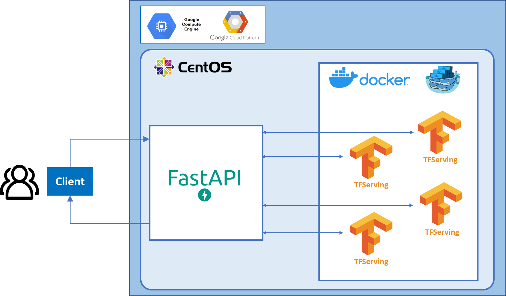

# Despliegue en producción de un Modelo TF2 de clasificación de imágenes.



## Crear servidor de despliegue

En primer lugar, se va a crear el servidor de despliegue en producción que vams a utiloizar en este proyecto. Para ello necesitamos crear una cuenta en Google Cloud Plataform, donde nos dan la posibilidad de crearnos una cuenta gratuita de 90 días con 300 USD en crédito para poder utilizar servicios como Compute Engine, Cloud Storage y BigQuery.

Para acceder visite el siguiente enlace: https://console.cloud.google.com/


Una vez registrados, nos debe aparecer la página principal con el Dashboard general de la aplicación:


Seguidamente rocedemos a crear un nuevo proyecto de trabajo, pulsamos sobre el desplegable de proyectos, ```Despliegue TF2x``` en mi caso, y nos aparece la siguiente ventana emergente:


Pinchamos sobre ```NUEVO PROYECTO``` y nos aparece la ventana creación de un nuevo proyecto. Aquí asignamos el nombre que queramos para nuestro proyecto, en mi caso ```Despliegue TF2x```:


A continuación, vamos a crear la maquina virtual para el despliegue. En este caso vamos a utilizar una máquina con el so de Centos7. Para poder crear y configurar dicha máquina, primero hacemos una búsqueda ```Centos```y seleccionamos la ```CentOS 7```que vamos a dar de alta:


Una vez seleccionada nos aparece la siguiente ventana donde debemos iniciar la maquina pulsando sobre el botón ```iniciar```:


Una vez dentro, procedemos a configurar la máquina. en nuestro caso vamos a configurar el Tipo de máquina y su cortafuegos para permitir peticiones HTTP:

**Tipo de máquina**: e2-standard-4 (4 vCPU, 16 GB de memoria)


**Cortafuegos**: Permitir el tráfico HTTP.


Una vez configurada nos aparecera la siguiente ventana con nuestra máquina:


Como podeis observar también nos indica la IP externa de la máquina. Para acceder la la consola necesitaremos pulsar en el botón de ```PLAY``` y en el desplegable de ```SSH`` seleccionar la opción de abrir en una nueva pestaña del navegador:


Con ello, ya tenemos acceso a la consola de nuestro servidor, pero antes de seguir nos haria falta configurar las reglas del cortafuegos para permitir el acceso a través de los puertos de cada servicio.

La forma de acceder a esta configuración es pulsando en el desplegable de ```SSH``` en la opción de ```ver detalles de red```:


Una vez dentro, pinchamos sobre ```default-allow-http```:


Seguidamente damos click a la opción de ```EDITAR```:


Una vez dentro damos de alta todos los puertos utilizados en los servicios del proyecto:

- **9000**: API del servidor.
- **9001**: Visualizador de microservicios.
- **9002**: Prometheus.
- **9003**: Grafana.


Con todos estos pasos ya tendriamos acceso a la maquina virtual del servidor y podriamos proceder a configurar el entorno de trabajo y a dar de alta los servicios de nuestro proyecto.


## Configuración del entorno de trabajo

Una vez ...
```cmd
####  CentOS Configuration ####

#Install tools on CentOS 7:
sudo yum –y update
sudo yum install -y zip unzip nano git tree wget

#Install an environment manager (Miniconda):
curl -LO https://repo.continuum.io/miniconda/Miniconda3-latest-Linux-x86_64.sh
sh ./Miniconda3-latest-Linux-x86_64.sh

#Loading environment variables:
source ~/.bashrc

#Deactivate current environment (base):
conda deactivate
```

A continuación se crea el entrono de trabajo de producción ....

```cmd
#### Create PROD Environment ####

#Create an environment called "PROD" and install Python
conda create -n PROD pip python=3.7.0

#Activate PROD Environment
conda activate PROD

#Install python
pip install python=3.7.5

#Install TensorFlow in PROD:
pip install --no-cache-dir tensorflow==2.3.0
pip install tensorflow-serving-api

#Install FastAPI, uvicorn and other tools in PROD:
pip install fastapi
pip install uvicorn # ASGI server for production: https://github.com/tiangolo/fastapi
pip install python-multipart
pip install pillow #Pil image needed for tf.keras image

#Testing tools installation version:
python -c "import platform; print('/nPython: ',platform.python_version())"
python -c "import tensorflow as tf; print('TensorFlow: ',tf.__version__)"
python -c "import fastapi; print('FastAPI: ', fastapi.__version__)"

#Deactiavate current environment:
conda deactivate

```


```cmd
#### Deployment PROD ####

#Start docker service
sudo systemctl start docker

#Remove all Containers (optional)
docker rm $(docker ps -aq)

#Folder with PB model
cd ~
export MODEL_PB=$(pwd)/Pebrassos-detection/model/tf2x/tensorflow

#Start Docker Swarm
docker swarm init

#Start TensorFlow serving with docker-compose:
cd $(pwd)/Pebrassos-detection/Deployment/docker

docker stack deploy -c compose-config-PROD.yml PROD-STACK

```

## Chequear servivios activos

```cmd
docker stack ls
docker service ls
docker container ls

#Visualize servicew on web browser (don't forget open port 9001)
http://<public IP>:9001/

#Activate PROD environment
conda activate PROD

#Locate on test folder
cd $(pwd)/Pebrassos-detection/Deployment/test

#TFserving on gGPR 9500 --> 8500
python test-tfserving-gRPC-PROD.py /
    --images $(pwd)/images/img01.jpg,$(pwd)/images/img02.jpg,$(pwd)/images/img03.jpg /
    --model flowers /
    --version 1 /
    --port 9500

# Remove stack
docker stack rm PROD-STACK

#Leave docker swarm
docker swarm leave --force

# Stop docker
sudo systemctl stop docker
```

## Servicio FastAPI 

```cmd
#### Start FastAPI service  ####

# starting the service
cd $(pwd)/Pebrassos-detection/Deployment/service

# Activando environment PROD
conda activate PROD

# starting web-service
uvicorn fastapi_service_PROD:app --port 9000 --host 0.0.0.0

#Stop Web Service: Ctrl + C

#Deactivate PROD env
conda deactivate
```

## Monitorización

```cmd
#### Monitoring ####

#Prometheus: IP:9002

#Grafana: IP:9003
#>> admin/admin
#Grafana Datasource:
#>> public-ip:9002
#>> server

#Grafana dashboards to import
https://grafana.com/grafana/dashboards?dataSource=prometheus

```